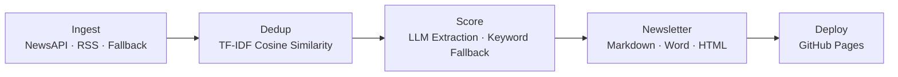

# FMCG Deal Pulse

[](https://github.com/deveshsharma/fmcg-deal-newsletter-agent/actions/workflows/newsletter.yml)

Automated newsletter pipeline that discovers, scores, and summarizes FMCG M&A deals. Outputs Markdown, Word, and a styled HTML newsletter deployed to GitHub Pages.

## Live Newsletter

After enabling GitHub Pages, the latest newsletter is available at:
`https://<username>.github.io/fmcg-deal-newsletter-agent/newsletter.html`

## Overview

The pipeline ingests articles from NewsAPI and Google News RSS, deduplicates them using TF-IDF cosine similarity, scores relevance via LLM (with keyword fallback), and generates a multi-format newsletter (Markdown, Word doc, HTML).

## Pipeline Architecture



1. **Ingest** — Fetches articles from NewsAPI, Google News RSS feeds, or a fallback JSON dataset. Full-text extraction via trafilatura runs in parallel threads. Performs URL-level deduplication across sources.
2. **Dedup** — TF-IDF vectorization + cosine similarity to cluster near-duplicate articles. Keeps the best source per cluster and tracks corroboration counts.
3. **Score** — LLM-based structured extraction (deal type, acquirer, target, value, sector) with keyword-only fallback. Articles below the credibility cutoff are discarded. Concurrent async LLM calls (capped at 5, 60s timeout) via OpenRouter.
4. **Newsletter** — Generates Markdown, Word (.docx), and styled HTML newsletters with headline deal, briefs, sector pulse, watchlist, and executive summary. LLM-generated narrative sections with template fallbacks.

Built on [LangGraph](https://github.com/langchain-ai/langgraph) for orchestration. Deployed via GitHub Actions (weekly schedule + manual trigger).

## Setup

```bash
pip install -r requirements.txt
python -m spacy download en_core_web_sm
```

Copy `.env.example` to `.env` and fill in the API keys:

```bash
cp .env.example .env
```

## Usage

```bash
# Full pipeline — fetch from NewsAPI + RSS, then process (requires API keys)
python main.py

# Demo mode — uses fallback dataset, no API keys needed
python main.py --demo

# Skip ingestion — process existing raw_deals.json (dedup → score → newsletter)
python main.py --skip-ingest

# Skip ingestion + disable LLM (keyword scoring only)
python main.py --skip-ingest --no-api
```

## Output

All generated files go to `output/`:

| File | Description |
|---|---|
| `raw_deals.json` | Raw ingested articles |
| `deduped_deals.json` | After TF-IDF deduplication |
| `scored_deals.csv` | All articles with scores and structured fields |
| `newsletter.md` | Final newsletter in Markdown |
| `newsletter.docx` | Word document version |
| `newsletter.html` | Styled HTML newsletter (deployed to GitHub Pages) |
| `llm_cache.json` | Cached LLM responses (avoids re-scoring) |

At the end of each run, the pipeline prints an LLM cost summary (tokens + USD via OpenRouter).

## Configuration

All tunable parameters live in `config.py`:

- `SIMILARITY_THRESHOLD_TFIDF` — Cosine similarity threshold for dedup (default: 0.30)
- `RELEVANCE_CUTOFF` — Minimum score to include in newsletter (default: 0.65)
- `CREDIBILITY_CUTOFF` — Minimum source credibility for LLM scoring (default: 0.50)
- `MODEL` — LLM model for scoring and newsletter generation
- `FMCG_KEYWORDS` / `DEAL_KEYWORDS` — Keyword lists for fallback scoring
- `SOURCE_TIERS` — Domain credibility scores

## Testing

```bash
pytest test/
```
